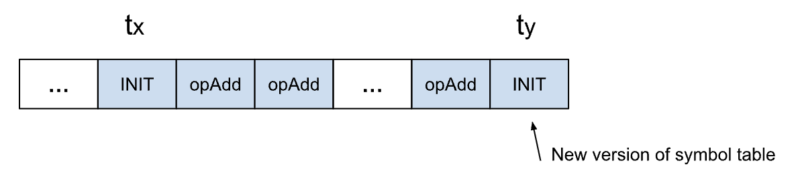

# HCIndex (High Cardinality Indexing) for MongoDB Timeseries

# 1. Abstract

This document proposes HCIndex (High Cardinality Indexing), a time-parametrized indexing framework
designed for high-volume, high-cardinality time-series workloads.

HCIndex models index structures using online algorithms that evolve
incrementally with observed data distributions. The objective is to enable
low-latency query execution (including single-digit millisecond targets) in
environments where attribute cardinality may reach hundreds of billions of
distinct values.

Although MongoDB is used as the experimental implementation platform, the
techniques described herein are applicable to any database system providing
comparable time-series read and write semantics.

The establishment of an enterprise-grade high-cardinality indexing foundation
is expected to unlock emerging analytical workloads and position the database
as a primary system of record for event-driven architectures, thereby
simplifying data stacks and improving developer experience.

The prosed idea is provided along with a [reference implementation](https://github.com/10gen/mongo/tree/rravindr/hcrefimpl/src/mongo/db/exec/timeseries/hcindex)
in the MongoDB database code and is located in the same branch where this RFC
is. See Reference section for more information.

This work is largely based upon the previous research outlined in the initial
[research work](https://docs.google.com/document/d/1FCaXGIuEtUtW3GrZ_xgCeCqZ5sXcEHSM2TlOxsTafds/edit?usp=sharing)
and incorporates lessons from the [M3DB reference implementation](https://github.com/rmravindran/boostdb) One of the major
benefit that MongoDB has over Clickhouse and Pinot is its bucketing model. This
model provides enough primitives to build the the time-parametrized index
structures. From my own personal experience through this reference
implementation, I felt that to some extent, MongoDB was easier to build-on than
M3DB and Pinot. Some pushdown of predicates to the bucket level is harder
compared to those 2 databases because MongoDB lacks an intermediate
representation. But, it is not terribly hard either.


---

# 2. Status of This Document

This document defines a research and implementation proposal.

**Status**: Complete

# 3. Motivation

## 3.1 Problem Domain

Event-sequence (e.g timeseries) datasets represent one of the fastest growing
and most data intensive segments of the database market.

Representative workloads include, but are not limited to:

- E-commerce event streams
- IoT telemetry pipelines
- Financial market feeds
- Observability systems (metrics, logs, traces)

These datasets are increasingly generated and consumed by automated systems,
including machine learning and AI-driven platforms. As a result:

- Manual index curation is impractical.
- Static schema-driven optimization is insufficient.
- Attribute dimensionality evolves over time.
- Cardinality frequently grows without bound.

Additionally, such datasets have become increasingly semi-structured, leading
to industry-wide adoption of specialized analytical engines.

## 3.2 High-Cardinality Attribute Explosion

A recurring challenge in time-series systems is the management of tag sets
whose cardinality grows rapidly and whose attributes are central to match and
filter query operations.

In conventional implementations:

- Attributes are stored as metadata.
- Reverse (inverted) index structures are constructed per attribute.
- Index structures are built using block- or segment-oriented models.

These approaches exhibit the following limitations:

1. Index construction overhead increases superlinearly with cardinality.
2. Ingestion throughput degrades due to metadata amplification.
3. Query latency increases under high-dimensional filter workloads.
4. Memory footprint becomes unstable under extreme cardinality growth.

Traditional block- or segment-based indexing models are not designed for
low-latency read/write latency at extreme data volumes and attribute
dimensionality.

## 3.3 Objective

HCIndex aims to address these limitations by:

- Modeling index structures as time-parameterized, window-scoped entities.
- Leveraging online algorithms that adapt to evolving data distributions.
- Enabling ingestion-safe index construction.
- Supporting dynamic, frequency-aware index materialization.
- Preserving low-latency query semantics at scale.


# 4. High Level Design

Time parametrized high cardinality indexing treats index structures as
ephemeral and organizes data for scan optimized access. Inverted indexes are
built dynamically based on the column density and observed query patterns over
specific dimensions and time windows. While “time” is the primary parameter due
to its importance in time series and analytics workloads, the model generalizes
to any monotonically increasing field that can be partitioned into ordered
ranges.

The model enables seek-optimized indexes to be field and/or time-window
specific while preserving high ingestion throughput. With TimescaleDB,
ClickHouse and Pinot, when a high-cardinality dimension becomes too dense,
index lookups degenerate into scans and indexing provides no benefit. Such
indexes are avoided by the proposed model. The model also exploits the fact
that not all time ranges are equally important, with rich indexing typically
required only over recent data. This naturally enables detection and
optimization of rollup patterns (more on this later).

### Major Structures of this proposal

**Symbol Dictionary**: Mapping metadata values to small integers <br>
**Attribute Table**: Storing metadata as rows of integer indices. In-memory
columnar representation of the table for efficient SIMD/AVX scans.<br>
**Efficient Encoding**: Converts metadata to compact integer arrays <br>
**Schema Evolution**: Dynamically adding columns as new fields appear <br>
**Time Parametrized Index Structures**: Storing dictionaries and tables as
sequences of operations (INIT, opADD, FIN, REF) rather than complete snapshots <br>
**Inverted Index**: The reverse index on selected fields on certain buckets.
Time/sequence parametrized index structures allows us to capitalize that in
analytics, not all ranges are equally queried and not all dimensions are equally
important. Selecting this automatically is very critical for user-experience.<br>

## 4.1 Symbol Dictionary

A symbol dictionary is a mapping of text symbols to integral identifiers. It is
both stored and constructed as a sequence of operations applied in a streaming
manner. INIT operation creates a new symbol dictionary with a monotonic
increasing version and opAdd makes an additive change to the symbol dictionary.

<p align="center">
  <a href="SymDict.png">
    
  </a>
</p>

**Fundamental Properties**

1. To decode the symbols of a time series at tx, you need the symbol dictionary
   built from the INIT instruction that appeared in the stream to tx
2. Stream is written at a specific interval. This ensures that a search to the
   relevant INIT instruction is always bounded. (In reference implementation it
   is flushed on every InsertOne or InsertMany request).

**Dictionary Construction**

- Construction starts with the INIT (version, [symbols]).
- Following one or more ADD (version, [symbols]) will add additional symbols to
  the symbol dictionary.
- Finally the FIN(version) instruction signals the finalization of the table.
  This means no more operations will be done to the table with that version.
  FIN is not a necessary operation. It is usually used in archival data to
  prevent modifications in the future.
- REF(version, t_y) implies that the dictionary that should be used for this
  interval is the one that was populated at t_y

### 4.1.1 Time-Window and Dictionary Construction
Each window is associated with a metadata dictionary of the form:

```
window → {value → localValueID}
```

Dictionaries contain only values initially observed or promoted in that
window, except when inheritance rules apply.

**Dictionary Inheritance**: We do not maintain a global dictionary. Instead,
symbols are references in a composition of a base dictionary+local dictionary.
If values are observed only in window-X, the symbol will be present in the
local dictionary for that window. This ensures that extremely high cardinality
data will not blow up global index space. Dictionary inheritance has 3
components:

1. Base Dictionary (non-modifiable referenced dictionary from any of the previous window)
2. Inherited Local Symbols (non-modifiable local dictionary from any of the last 2 windows)
3. Local Symbols (modifiable local dictionary for the current window)

This avoids dictionary growth for sparse metadata and bounds the per-window state.

### 4.1.2 Offline Dictionary Merge
As windows age out of the active write path, dictionaries may be merged offline
into a more compact representation. This should be done outside the ingestion
path and should not affect active write regions.

### 4.1.3 Base Dictionary Refresh
At some point it makes sense to use a new base dictionary. You could imagine
data evolution where symbols will be dropped/evolved and would not make sense
even in the Base Dictionary. From prior experience a “daily” or “weekly” reset
will ensure that we are not carrying forward unnecessary symbols in the
dictionary and in-memory structures. This refresh interval should in practice
be driven by the dictionary's growth and dictionary’s information gain
statistics.


## 4.2 Attribute Table

Attributes are metadata, non-measurements, but data insights related fields
that need to be queried into a readable form. We separate (but could overlap)
fields that are necessary for optimal sharding behaviors and desired query
fan-out responses as “sharding tags”. We do not speak about them again and
are not part of the scope of the discussions in this proposal.

For example:

| time          | sharding tags                                     | attributes                                                                 | value |
|--------------|---------------------------------------------------|---------------------------------------------------------------------------|-------|
| 09:00:01.000 | [ (cluster, "nyc"), (service, "webapp") ]         | [ (container, "nyc01") ]<br>Encoded table entry: [9]                     | 30.4  |
| ...          | ...                                               | ...                                                                       | ...   |
| 09:00:05.200 | [ (cluster, "nyc"), (service, "webapp") ]         | [ (container, "nyc01"), ("node", "xyz") ]<br>Encoded table entry: [9, 158] | 29.8  |
| ...          | ...                                               | ...                                                                       | ...   |
| 10:30:02.100 | [ (cluster, "nyc"), (service, "webapp") ]         | [ (container, "nyc01"), ("pod", "pod123") ]<br>Encoded table entry: [9, 159] | 44.0  |

The Attribute Table is a window-scoped, in-memory columnar store optimized for
fast *rip-through (SIMD/AVX)* scans of individual fields and for scan
parallelization when needed. Data is stored as a list of column vectors, where
each vector corresponds to an attribute (column).

Because the underlying event payload is semi-structured, the set of columns is
not fixed. New columns are introduced as previously unseen fields appear in the
incoming data for that window. When a new column is added mid-window, the table
records the first row offset at which the column becomes valid. This allows
scans to skip rows where the column did not exist yet and avoids backfilling
earlier rows. Attribute table within a window is specific to that window. For
example, “pod” may have column index 0 in window A and could have index 1 in
window B. That is:

```
window → { rowId → { localColId → localValueID } }
```

Attribute table schema is represented as:

```
window → { fieldName → localColId }
```

**Note**: Within a window, a schema will evolve as new fields are discovered in the data.

## 4.3 Operational Instructions and Index Structures

### 4.3.1 Symbol And Attribute Table Operations

- INIT - Bootstrap operation for a new time window
  - Contains: symbol-to-id pairs, attribute schema, initial rows
  - Creates fresh Dictionary and AttributeTable for that window
- opADD - Incremental additions (two variants)
  - Symbol variant: Add new symbol-to-id mappings
  - Attribute variant (More on attributes in sections below): Add new column to
    schema or add new row to the table. A new row in the attribute table
    implies a new unique row within the interval.
- FIN - Finalize operation
  - Marks Dictionary and AttributeTable as complete/immutable
  - No more operations can be added after FIN
  - FIN is optional since during query time, the system looks for INIT and
    subsequent opADDs. FIN just serves as a marker to indicate that no more
    changes will be made even if a new insert is requested by the user.
- REF - Reference operation (optimization)
  - Only used in the Symbol Dictionary
  - Indicates this window reuses dictionary from a previous window
  - Avoids duplicating identical dictionaries
  - Example: In the case of the Merchant Transactions dataset, Since most
    common items are in the base dictionary, we can reuse it However, order
    numbers are an extremely high cardinality field and that we see in the
    current window are unique to this window and will be added to the local
    dictionary. In the below example, we are reusing the base dictionary
    (see REF) that contains bulk of the data from a previous window.

```json
{
 _id: ObjectId('695f114c524101152468cc9d'),
 timestamp: Timestamp({ t: 1765810680, i: 0 }),
 windowStart: Timestamp({ t: 1765810680, i: 0 }),
 windowEnd: Timestamp({ t: 1765810740, i: 0 }),
 period: 1,
 frequency: 1,
 REF: Timestamp({ t: 1765810560, i: 0 }),
 localIndexOffset: Long('179'),
 op: 'INIT',
 symbols: {
   '190': 304,
   '191': 305,
   '192': 306,
   '193': 307,
   '194': 308,
   '195': 309
 }
```


**Key Advantage**: Partial Reconstruction
To interpret data from 09:00-09:25 in a window that runs 09:00-09:59:
- Only reconstruct operations up to 09:25
- No need to read ahead to FIN at 09:59:59
- Referenced dictionaries can also be reconstructed partially
- Referenced dictionaries + local window specific opADDs = complete dictionary
  and this allows for efficient seeks. High cardinality data that is unique to
  the local window does not need to be read into memory if we are not looking
  at the window.
- Enables efficient streaming queries on partial time ranges
- Reduces latency for older-window queries

### 4.3.2 Inverted Index For RowIDs
For high density (tags that map to more than 1 rows) having an inverted index
can be useful to eliminate the need to scan all the rows for a given tag.
However, in the analytics space, it is common to have certain dimensions that
are very sparse (or extremely dense) and not worth building an inverted index
for. Thus it is important to be able to dynamically build inverted indexes for
those significant dimensions only.

#### Time-partitioned bitmap (roaring) index for metadata fields

**Indexing Model**

For each metadata column (except those explicitly configured as sparse or detected
as cardinality-exploding), we maintain a time-scoped bitmap index of the form:

`(column, value, window) → bitmap(RowIDs)`

RowIDs are local to the time window. The index is a write-path append-only structure
with no per-row deletions. That is, eviction is performed by dropping the entire window.


### 4.3.3 RegEx Support
Regex predicates are supported using

`regex → matching values → OR(bitmaps) → matching RowIDs`

1. Enumerate metadata values in the window dictionary that match the regex
2. For each matching value, fetch corresponding bitmaps
3. OR bitmaps to compute matching row set
4. For columns without bitmap coverage, fall back to scan within the window

This enables regex filtering without scanning the full time window whenever a matching
dictionary and bitmap exist. Each window may have:

| RegEx Index | Notes                                                                 |
|------------|----------------------------------------------------------------------|
| Trie       | Fast prefix/suffix and moderate regex; inexpensive incremental updates |
| FST        | More compact; faster regex enumeration; ideal under heavy regex load |


**Selection criteria**:

Smaller or dynamically changing value sets → Trie
Larger or stable value sets with heavy regex traffic → FST

Inherited windows share the inherited RegEx representation. Local symbols, by definition,
only appear in that interval, and never need to be indexed into any structures. It is better
to just apply scan operations instead of spending any time indexing them. This is key to speed!


# 5. Separation of Symbol Dictionary, Attribute Table, Indexes and Measurements

It is important to understand that separating the raw data from its structures helps
us to move many filters up the query pipeline and avoid decoding the packed structures
only when it is absolutely necessary. Second, having an attribute table encoded with integer
representations arranged in a packed sequential contains allows us to rip through (more compact
structure) integer comparisons using various vector operations (SIMD/AVX optimizations). We
can get to a state where for most queries, memory usage will be independent of total
collection cardinality.

Cons of this approach is that query predicates need to be rewritten to use integer values
rather than original string values. In addition to this, the transformation itself is
bucket dependent. The concept of “Row-9 or Row 10” in bucket X only makes sense in the context of bucket X.

## Why is this advantageous in analytics?

Analytics workloads follow a two-phase pattern:

### Exploration Phase (Scan-Optimized)

- Users/AI systems explore data without knowing what they are looking for
- System cannot predict query patterns, so building indexes upfront is wasteful
- Time-parametrized bucket scans are efficient: scan only the time windows of interest
- Metadata is already compressed (integers vs strings), making scans fast
- Attribute table acts like an inverted index for many rudimentary filtering
- SIMD-friendly encoding of attribute table allows for efficient scanning using CPU vector
instructions

### Query Phase (Seek-Optimized)

- Once users find something interesting, they write specific queries
- Inverted indexes are built dynamically on frequently-queried fields
- Indexes are bucket-specific and time-parametrized, making them compact. That is, not every bucket needs to have the same index.
- Dimensional statistics guide which fields to index within each bucket
- For common patterns (e.g., aggregations), predicates can be pushed to bucket level, avoiding unpacking entirely

This approach is superior to building all-encompassing indexes upfront because
- Indexes only exist where they are useful
- Sparse data doesn't create bloated indexes


# 6. Metadata Index Options

This section defines the configuration parameters governing metadata index construction
and maintenance. Unless otherwise stated, all thresholds are expressed as percentages
of total observed row count within a window. The index is controlled via
`timeseries.hcindex_options`

## 6.1 `buildMetadataIndex`

**Type:** Boolean
**Default:** `true`

The system **MUST** enable metadata indexing by default.

---

If `buildMetadataIndex` is set to `false`:

- The system **MUST NOT** build metadata indexes during ingestion.
- The system **MUST NOT** trigger dynamic index construction.
- Previously materialized metadata indexes **MAY** remain readable but **MUST NOT** be updated.

---

## 6.2 `sparseIndexThreshold`

**Type:** Percentage (0–100)

A value whose relative frequency is strictly less than `sparseIndexThreshold` **MUST** be treated as sparse.

For sparse values:

- The system **MUST NOT** pre-build an index during ingestion.
- The system **MAY** evaluate such values via scan-based execution.

---

## 6.3 `denseIndexThreshold`

**Type:** Percentage (0–100)

A value whose relative frequency is strictly greater than `denseIndexThreshold` **MUST** be considered dense.

For dense values:

- The system **MUST** build and maintain an index during ingestion for low- and moderate-cardinality dimensions.
- For extreme high-cardinality dimensions (as defined by implementation-specific limits), the system **MAY** override this requirement to prevent pathological memory growth.

Implementations **SHOULD** document the criteria used to classify extreme high-cardinality dimensions.

---

## 6.4 `dynamicIndexBuild`

**Type:** Boolean
**Default:** Implementation-defined

If enabled, and if a value’s relative frequency lies between `sparseIndexThreshold` and `denseIndexThreshold`, the system:

- **MAY** construct an index lazily upon query access.
- **SHOULD** persist the constructed index for subsequent queries within the same window.
- **MUST NOT** violate memory or storage safety constraints during dynamic construction.

If disabled, intermediate-frequency values **MUST NOT** be dynamically indexed.

---

## 6.5 `excludedColumns`

**Type:** List of column identifiers

Columns listed in `excludedColumns`:

- **MUST NOT** be indexed under any circumstances.
- **MUST** override `denseIndexThreshold`, `dynamicIndexBuild`, and `includedColumns`.

If a column appears in both `excludedColumns` and `includedColumns`, the system **MUST** treat this as a configuration error.

---

## 6.6 `includedColumns`

**Type:** List of column identifiers

Columns listed in `includedColumns`:

- **MUST** always be indexed, regardless of observed frequency.
- **MUST** bypass sparse/dense threshold evaluation.
- **MUST** still respect global safety constraints (e.g., memory limits).

---

```
valueFrequency < sparseThreshold → no index
valueFrequency > denseThreshold → always indexed for small and high-cardinality space, but ignored for extreme high cardinality dimensions (e.g. uniq ids)
otherwise → indexed dynamically based on observed ingestion and query statistics.
```

7 Proposed Implementation Phases

### 7.1 Phase 0 Reference Implementation - DONE
This Code.
- Basic implemenation of Dictionary and Attribute Table
- ompact roaring Bitmap Index
- Query path integration (find/match/count etc...)
- Expression rewrites (splits the expressions into bucket-matching vs measurement matching). This needs to be moved out to proper PlatStage operations.
- Minimum explain plan visibility.
- Minimal unit tests
- No multi-threaded writes. Only one writes to adictionary/attribute/index at a time.
- Local database only (mongos integration not tested)
- And you also get some bugs!
- Few things are also disabled, like verfication after write etc…

## 7.2 Phase 1 Implementation
A chunk of changes are required on the query side to move foward into production. In addition to the following, there are many TODO comments in the reference implementation that need to be addressed.
- PlanStage implementations that will provide better re-write/optimize the queries
- Better pushdowns. (e.g. count should use the Attribute+Bitmap instead of unpack-stage)
- Compaction for Attribute Table and Bitmap Index for insertOne operations.
- Also create BitmapIndex summaries. This can void us requiring a full read of the index to serve aggregations (e.g. count)
- Support more aggregation functions. I have only tested basic ones Phase-0
- Implement Trie (Prefix/Suffix expressions are relatively common in analytics)
- More Intelligent Indexing. 99% of the users should never have to specify indexing configurations.
- Multi-writer support
- Auto-creation of bitmap index based on dynamic density/information gain.
- Drop non-referenced dictionaries from the older timespan from the memory
- SIMD/AVX optimizations for scanning AttributeTable
- Unit Tests

## 7.3 Phase 2 Implementation
- Implement FST (full regex support)
- Add support for offline dictionary merge
- Add support for cost model integration
- Add support for explain plan visibility
- Implement Aggregation Buckets & Query Pushdown to use these buckets
  - e.g. topK, summarize queries should git the aggregations. These aggregations can be created in an ephemeral concept as well.
- Integration Tests


# References

Reference Implementation In MongoDB: https://github.com/rakmaya/mongo/tree/tsrefimpl/src/mongo/db/exec/timeseries/hcindex

MongoDB Code Contributions: https://github.com/mongodb/mongo/compare/master...rakmaya:mongo:tsrefimpl?diff=unified&w

Initial RFC: https://docs.google.com/document/d/1FCaXGIuEtUtW3GrZ_xgCeCqZ5sXcEHSM2TlOxsTafds/edit?usp=sharing

Early Implementation in M3DB: https://github.com/rmravindran/boostdb

# Appendix: Reference Implementation - Developer Documentation

I am calling the reference implementation as  "Phase-0" since this is not a production-grade implementation.
I have outlined what is needed at the minimum in the Phase-1 and subsequent possibilities in other phases, if the proposal is to be funded.

## Collection Naming Convention
Symbol Operations: hcindex.ops.symbols.<collectionUUID> (in user's database) <br>
Attribute Operations: hcindex.ops.attributes.<collectionUUID> (in user's database) <br>
Bitmap Index: hcindex.idx.bitmap.<collectionUUID>  (in user's database) <br>

Most of the code: (there are changes on multiple other files)
    `src/mongo/db/exec/timeseries/hcindex/`

See the diff to understand what changed: https://github.com/mongodb/mongo/compare/master...rakmaya:mongo:tsrefimpl?diff=unified&w


## Write Path

```
User Insert
    ↓
makeNewDocumentForWrite() [timeseries_write_ops_utils_internal.cpp]
    ↓
HCIndexCollectionManager.encodeMetadata()
    ↓
TemporalAttributeTable.insertRow()
    ↓
TemporalSymbolDictionary.getOrInsertSymbol() [for each field value]
    ↓
Returns rowId (int64_t)
    ↓
Store rowId in bucket's data.rowId field (BSONColumn)
    ↓
HCIndexWriter.writeSymbolOp() [INIT/ADD operations]
HCIndexWriter.writeAttributeOp() [INIT/ADD operations]
    ↓
Operations stored in hcindex.ops.symbols.* and hcindex.ops.attributes.*

```

## Read Path

```
Query Execution (e.g find/aggregation)
    ↓
InternalUnpackBucketStage.doGetNext()
    ↓
BucketUnpacker.reset() [detects HCIndex bucket]
    ↓
Initialize _rowIdColumnIterator from data.rowId BSONColumn
    ↓
getNextMatchingMeasure() [for each measurement]
    ↓
BucketUnpacker.getNext() [unpacks measurement]
    ↓
getDecodedMetadataForMeasurement(index) [if HCIndex bucket]
    ↓
Extract rowId from cached iterator (O(1) per measurement)
    ↓
HCIndexCollectionManager.decodeMetadata(rowId, timestamp)
    ↓
TemporalAttributeTable.getRow() → symbol indices
    ↓
TemporalSymbolDictionary.decodeSymbols() → BSONObj
    ↓
Add decoded metadata to measurement document
    ↓
Apply event filter (if metadata predicates exist)
    ↓
Return matching measurement to query engine
```

## Important Notes About Reference Implementation

These notes are my development notes, and should help anyone who wants to take over the reference
implementation and continue forward the work to a production grade implementation.

### Remove Query Pipeline hacks
MongoDB's query planner creates a match stage before the unpack bucket stage and it renames the
provided metadata field name (I am using "metadata") to the bucket-level field name (“meta”). However,
for HCIndex collections:

- The bucket's meta field contains only window metadata (windowStart, windowEnd, hcindex flag)
- The actual measurement metadata is encoded as rowIds in the data section
- When unpacking, the rowIds are decoded back to the original metadata with the original field names

**Hack for now**: Reverse the name in the event filter:
- Detect when a `$match` stage before the unpack bucket stage contains metadata predicates
- Rename the field names back from meta to the original metadata field name using copyExpressionAndApplyRenames()
- Set this renamed expression as the event filter
- Remove the `$match` stage since its predicates are now applied as event filters after unpacking

**Query Pipeline Optimization**: Match Stage Swapping Disabled for HCIndex
MongoDB's query planner normally optimizes pipelines by pushing `$match` stages before `$_internalUnpackBucket`
to filter buckets early. However, this optimization is disabled for HCIndex collections because:
- HCIndex metadata is encoded as rowIds in the bucket's data section, not in the bucket-level meta field
- The query planner cannot evaluate metadata predicates at the bucket level without first decoding the rowIds
- Pushing `$match` before unpacking would filter out valid buckets

**Current Short-Circuit**: The canSwapWithMatch constraint is set to false for HCIndex collections,
preventing the query planner from reordering stages. Metadata predicates are instead applied as event
filters after unpacking and decoding.

**More Optimization**: HCIndex's bitmap/trie should be used for many bucket-level filtering optimization:
1. `$count`/stats etc... can just hit the index structures (right now it needs to unpack)
2. Teach the query planner to recognize HCIndex collections
3. Replace the `$match` stage with a custom `$_internalHCIndexScan` stage that:
   1. Uses the bucket-level inverted index to identify matching buckets
   2. Returns bucket IDs without unpacking
4. Follow the scan with `$_internalUnpackBucket` to unpack only matching buckets
5. Apply remaining predicates as event filters if needed

### Make Verify Function Work with HCIndex
The metadata verifier in timeseries_write_ops_utils_internal.cpp currently skips HCIndex batches
entirely. Implement HCIndex-aware verification that validates:
- rowIds are valid (within bounds of attribute table)
- rowIds correspond to valid metadata
- Window metadata is consistent

### Verify ExpressionContext::getUUID() is Set in All Situations
The read path relies on `ExpressionContext::getUUID()` to retrieve the collection UUID for
HCIndexCollectionManager lookup. This is used in `InternalUnpackBucketStage::doGetNext()`
to get HCIndexCollectionManager. Need to verify that `getUUID()` is reliably set in all
query execution contexts:
- All query path
- Aggregation pipelines
- Filtered queries
- Sorted queries
- Indexed queries

### Vertical Scalability - Multi-Writer Enablement
Currently, there is only “one structure per window”. This inhibits vertical scalability. In M3DB and
Pinot cases, I had used the concept of “series family” to allow multiple writes per window. This requires 2 things:

- TemporalSymbolDictionary structure to support a map like: `(streamNumber+windowStart) → SymbolDictionary`
- Similar map for AttributeTable and Bitmap index.
- Similarly, allowing HCIndexWriter and HCIndexReader to allocate one ops collection per “stream” will allow a stream to be used by a writer.
